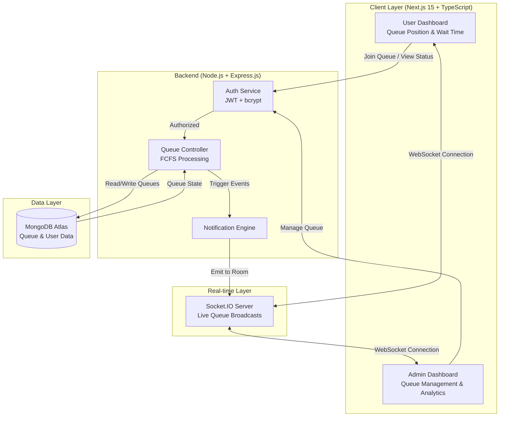

# FastQ - Smart Queue Management System

Live: https://fastq-ichy73kkw-aakarsh12xs-projects.vercel.app/

## System Design


## Preview


## About

FastQ is a real-time queue management system for canteens, hospitals, offices, and similar environments. It allows users to join queues remotely and track their position while giving admins full control and analytics.

## Features
 
### Users
- Join queues remotely  
- Track real-time position  
- View estimated wait time  
- Access history and analytics  
- Rate queues  

### Admins
- Manage queues and users  
- View analytics dashboard  
- Send real-time updates  
- Customize queue settings  

## Tech Stack

### Frontend
- Next.js (App Router)  
- TypeScript  
- Tailwind CSS  
- Shadcn UI, Aceternity UI  
- Framer Motion  

### Backend
- Node.js, Express.js  
- MongoDB (Atlas), Mongoose  
- JWT Authentication, bcrypt  
- Socket.IO  
- Express Validator  

## Setup

### Clone
```bash
git clone https://github.com/aakarsh12x/FastQ-Smart-Queuing.git
cd FastQ-Smart-Queuing
```

### Backend
```bash
cd Backend
npm install
```

Create `.env`:
```env
PORT=5000
MONGODB_URI=your_uri
JWT_SECRET=your_secret
JWT_EXPIRE=7d
FRONTEND_URL=http://localhost:3000
```

Run:
```bash
npm run seed
npm run dev
```

### Frontend
```bash
cd Frontend/fastq
npm install
```

Create `.env.local`:
```env
NEXT_PUBLIC_API_URL=http://localhost:5000/api
```

Run:
```bash
npm run dev
```

## Default Credentials

Admin  
- admin_seed@fastq.dev  
- admin123  

User  
- user_seed@fastq.dev  
- password123  

## API Overview

### Auth
- POST `/api/auth/register`  
- POST `/api/auth/login`  
- GET `/api/auth/me`  

### Queues
- GET `/api/queues`  
- POST `/api/queues`  
- POST `/api/queues/:id/join`  
- POST `/api/queues/:id/leave`  

### Admin
- GET `/api/admin/dashboard`  
- POST `/api/admin/serve-next`  

## Project Structure

```
Backend/
Frontend/fastq/
```

## Deployment

Backend: Railway / Render  
Frontend: Vercel  

### Queue Endpoints
```
GET    /api/queues              - Get all queues
GET    /api/queues/:id          - Get queue details
POST   /api/queues              - Create queue (Admin)
PUT    /api/queues/:id          - Update queue (Admin)
DELETE /api/queues/:id          - Delete queue (Admin)
POST   /api/queues/:id/join     - Join a queue
POST   /api/queues/:id/leave    - Leave a queue
GET    /api/queues/:id/position - Get user position
```

### User Endpoints
```
GET  /api/users/profile    - Get user profile
PUT  /api/users/profile    - Update user profile
```

### Admin Endpoints
```
GET  /api/admin/dashboard  - Get admin dashboard stats
POST /api/admin/serve-next - Serve next user in queue
```

## 🔐 Environment Variables

### Backend (.env)
| Variable | Description | Example |
|----------|-------------|---------|
| `PORT` | Server port | `5000` |
| `MONGODB_URI` | MongoDB connection string | `mongodb+srv://...` |
| `JWT_SECRET` | JWT signing secret | `your_secret_key` |
| `JWT_EXPIRE` | JWT expiration time | `7d` |
| `FRONTEND_URL` | Frontend URL for CORS | `http://localhost:3000` |

### Frontend (.env.local)
| Variable | Description | Example |
|----------|-------------|---------|
| `NEXT_PUBLIC_API_URL` | Backend API URL | `http://localhost:5000/api` |

## 🧪 Testing

### Backend Tests
```bash
cd Backend
npm test
```

### Run Manual Tests
```bash
node test-backend.js
```

## 📦 Deployment

### Backend Deployment (Recommended: Railway/Render/Heroku)
1. Set environment variables on your hosting platform
2. Deploy the Backend folder
3. Update `MONGODB_URI` to use Atlas
4. Set `NODE_ENV=production`

### Frontend Deployment (Recommended: Vercel)
1. Connect your GitHub repo to Vercel
2. Set root directory to `Frontend/fastq`
3. Add environment variable `NEXT_PUBLIC_API_URL`
4. Deploy!

## 🤝 Contributing

Contributions are welcome! Please follow these steps:

1. Fork the repository
2. Create a feature branch (`git checkout -b feature/AmazingFeature`)
3. Commit your changes (`git commit -m 'Add some AmazingFeature'`)
4. Push to the branch (`git push origin feature/AmazingFeature`)
5. Open a Pull Request

## 📄 License

This project is licensed under the MIT License - see the [LICENSE](LICENSE) file for details.

## 👨‍💻 Author

**Aakarsh Shrey**
- GitHub: [@aakarsh12x](https://github.com/aakarsh12x)

### 🤝 Contributors
- **Whirphool** - Co-author for pair programming session

## 🙏 Acknowledgments

- [Next.js](https://nextjs.org/) - React framework
- [Tailwind CSS](https://tailwindcss.com/) - CSS framework
- [Shadcn/ui](https://ui.shadcn.com/) - UI component library
- [Aceternity UI](https://ui.aceternity.com/) - Beautiful UI components
- [MongoDB](https://www.mongodb.com/) - Database
- [Socket.IO](https://socket.io/) - Real-time communication

---

<div align="center">
Made with ❤️ by Aakarsh Shrey

⭐ Star this repository if you find it helpful!
</div>


---

## 

---

